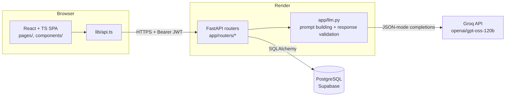
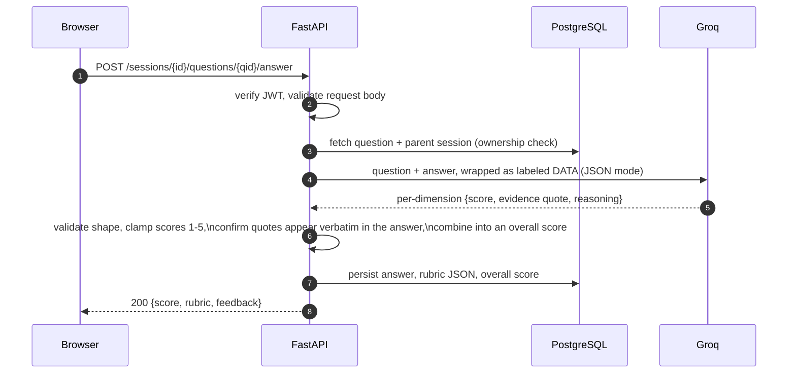
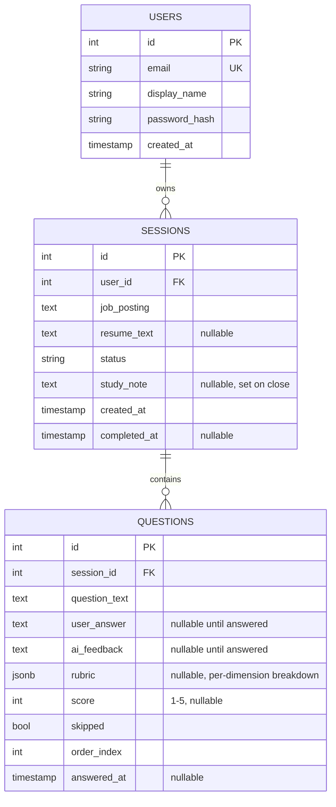

# Lens

> Paste a job posting. Get interview questions shaped to that role. Answer them —
> by typing or by voice — and get graded like a human would, with the exact phrase
> you wrote next to every score.


Lens is a full-stack interview-prep tool for students and job seekers preparing for
co-op and internship interviews. It's a real, working product, not a demo shell: auth,
a Groq-backed question generator, a four-dimension AI grading rubric with evidence
validation, resume-blended question generation, and a study-note generator are all
wired to a live Postgres database.

**Live demo:** **[lens-tau-nine.vercel.app](https://lens-tau-nine.vercel.app/)** — the
API runs on Render's free tier and spins down when idle, so the first request can take
30–60s to wake up. Every request after that is instant.

---

## Feature Overview

| Feature | What it does | Backing tech |
| --- | --- | --- |
| **Question generation** | Turns a pasted job posting into 5 role-shaped interview questions | Groq `openai/gpt-oss-120b`, JSON mode |
| **Resume-blended questions** | Optionally blends an uploaded resume into generation — 3 posting-grounded + 2 resume-grounded questions | `app/resume.py` (pypdf / python-docx) |
| **Rubric grading** | Scores each answer on completeness, substance density, reasoning, and correctness (1–5 each), every dimension backed by a quote validated against the actual answer text | `app/llm.py::evaluate_answer` |
| **Study note** | Aggregates the weakest-scoring dimensions across a session into one actionable note | `app/study.py` |
| **Voice answers** | Speech-to-text input with sentence-boundary-aware transcription, so live scoring evidence still quotes cleanly | `useSpeechRecognition`, `lib/segmentation.ts` |
| **Delivery metrics** | Speaking pace + filler-word count for voice answers — informational only, never touches the score | `lib/delivery.ts` |
| **Natural voice playback** | Reads questions aloud; browser TTS by default, an opt-in in-browser neural voice for higher quality | `lib/tts.ts`, `lib/tts.worker.ts` |
| **Session history** | Every past session saved and revisitable, open or filed | `GET /sessions` |

---

## Architecture



The frontend never calls Groq directly. Every prompt is built, sent, and validated
server-side in `app/llm.py`, so the API key never reaches the browser and a malformed
or manipulated model response is rejected before it's ever persisted or shown.

---

## Features in Detail

### Question generation

A pasted job posting is sent to Groq with `response_format={"type": "json_object"}`
and a system prompt that describes the exact expected shape. The backend then
strictly validates the parsed response — question count, types — before storing
five `Question` rows upfront (`POST /sessions/{id}/questions`). Nothing about
question generation is conversational; each call is independent and stateless.

### Resume-blended questions

Uploading a resume (`POST /sessions/{id}/resume`) parses it server-side —
`pypdf` for PDF, `python-docx` for `.docx` — caps the upload at 5MB and the stored
text at 20k characters, and guards `.docx` parsing against zip-bomb-style
decompression by checking the archive's central directory sizes before reading it.
The extracted text is blended into the next question-generation call, producing
three job-posting-grounded questions and two grounded in the candidate's actual
experience.

### Answering & grading

This is the core interaction in the app, and the one with the most engineering
behind it:



Each answer is scored on four dimensions — *completeness*, *substance density*,
*reasoning*, *correctness* — not one opaque number. Every dimension score carries a
direct quote from the answer, and the backend confirms that quote actually appears in
the submitted text (normalized substring match) before trusting it. The overall score
isn't a flat average: a **central-dimension ceiling** combination means a well-written
but off-topic answer can't out-score its own completeness and correctness — those two
dimensions cap what the average is allowed to produce.

### Study note

At session close (`PATCH /sessions/{id}`), `app/study.py` looks across every answered
question's rubric, finds the dimensions that scored weakest, and sends that summary to
Groq to generate one short, specific "what to study next" note — grounded in what the
candidate actually got wrong, not generic advice.

### Voice mode

Answers can be dictated via the Web Speech API. The tricky part isn't transcription —
it's that the API finalizes on short phrase-pauses, not sentence boundaries, so naively
joining every "final" result with a period fragments text mid-thought and would break
the backend's exact-substring evidence matching. `lib/segmentation.ts`'s
`TranscriptBuilder` buffers consecutive finals into one sentence and only commits a
sentence break on a genuine pause, so the transcript reads naturally and evidence
quoting still lines up.

Delivery is tracked but never scored: `lib/delivery.ts` computes words-per-minute and a
filler-word count (um, uh, like, you know, ...) client-side from the transcript and
shown time, surfaced in a clearly separate, explicitly unscored panel. The four rubric
dimensions judge what was said, never how it was said.

Questions can be read aloud two ways: the browser's built-in `speechSynthesis` by
default (zero network, zero license exposure), or an opt-in Kokoro-82M neural voice
that runs entirely in a Web Worker so its one-time ~110MB model download and WASM
inference never block the UI thread.

### Session history & auth

Every session — in progress or completed ("filed") — is listed under Archive
(`GET /sessions`) and re-openable. Auth is JWT-based (`app/auth.py`): bcrypt-hashed
passwords, HS256 tokens with a 7-day expiry, and a `get_current_user` FastAPI
dependency guarding every session/question route.

> **Scope (by design):** Lens ships one tight loop — paste a posting → generate
> questions → answer → get graded → review. See "V1 Feature Lock" in `claude.md` for
> what's deliberately not built yet (e.g. verifying answers directly against resume
> claims, which the already-captured `resume_text` sets up for later).

---

## Data model



Notable decisions:
- A session's overall score is computed dynamically (`AVG` over its questions) rather
  than stored, so it can never drift out of sync with the underlying answers.
- `skipped` is the source of truth for a skipped question, not the absence of an
  answer — a question can legitimately be unanswered without being skipped while a
  session is still in progress.
- Deletes cascade: removing a user removes their sessions, which removes their
  questions. No orphaned rows.

---

## Tech Stack

| Layer | Technology |
| --- | --- |
| Backend | FastAPI (Python 3.12) |
| Database | PostgreSQL (Supabase) |
| ORM / migrations | SQLAlchemy 2.0 + Alembic |
| Auth | JWT (PyJWT, HS256) + bcrypt |
| AI | Groq (`openai/gpt-oss-120b`) via the official `groq` SDK |
| Frontend | React 19, TypeScript, Vite |
| Data fetching | TanStack Query |
| Styling | Tailwind CSS 4 |
| Voice | Web Speech API (STT), `speechSynthesis` / Kokoro-82M via `kokoro-js` (TTS) |
| Deployment | Render (API) + Vercel (frontend) + Supabase (Postgres) |

---

## Key Engineering Patterns

- **Evidence-grounded grading** — every rubric dimension score is backed by a quote,
  and the backend independently verifies the quote appears in the submitted answer
  before trusting or storing it. The model can't be taken at its word.
- **Central-dimension ceiling combination** (`app/llm.py::_combine_overall`) — the
  overall score is capped by the completeness and correctness dimensions, so
  substance and reasoning can't paper over an answer that's off-topic or wrong.
- **Mock-first LLM layer** — `USE_MOCK_LLM` gates every Groq call behind a
  deterministic mock response, so the full app (including CI-style test runs) works
  with zero API calls and zero cost when a key isn't configured.
- **Prompt isolation against injection** — job postings, resumes, and answers are
  wrapped and explicitly labeled as DATA, never placed in the system prompt, and
  covered by a dedicated test suite (`tests/test_llm_injection.py`).
- **Sentence-boundary transcript buffering** (`lib/segmentation.ts`) — voice input is
  buffered into real sentences on detected pauses rather than on the Web Speech API's
  own phrase-level finals, so downstream evidence-quote matching doesn't get corrupted
  by mid-thought punctuation.
- **Ownership-scoped queries** — `_get_owned_session` / `_get_owned_question` in
  `app/routers/sessions.py` enforce that every session and question lookup is scoped
  to the requesting user, returning a plain 404 (not 403) on mismatch to avoid leaking
  existence.
- **Zip-bomb-guarded document parsing** — `.docx` resume uploads are checked against
  the archive's internal central-directory sizes before extraction, rejecting a
  crafted file that would decompress far beyond its uploaded size.

---

## API Reference

All protected routes require `Authorization: Bearer <jwt>`.

| Method | Path | Auth | Description |
| --- | --- | :---: | --- |
| POST | `/auth/register` | – | Create a new user |
| POST | `/auth/login` | – | Log in, receive a JWT |
| GET | `/auth/me` | ✅ | Current user info |
| POST | `/sessions` | ✅ | Create a session from a job posting |
| GET | `/sessions` | ✅ | List past sessions |
| GET | `/sessions/{id}` | ✅ | Session detail + all questions |
| POST | `/sessions/{id}/resume` | ✅ | Upload a resume (PDF/DOCX) to blend into question generation |
| POST | `/sessions/{id}/questions` | ✅ | Generate the five questions via Groq |
| POST | `/sessions/{id}/questions/{qid}/answer` | ✅ | Submit an answer, get scored |
| POST | `/sessions/{id}/questions/{qid}/skip` | ✅ | Skip a question |
| PATCH | `/sessions/{id}` | ✅ | Close the session (generates the study note) |

---

## Project Structure

```text
lens/
├── main.py                    # FastAPI app, CORS, exception handling
├── app/
│   ├── routers/                # auth.py, sessions.py — route handlers
│   ├── models.py                # SQLAlchemy models (User, Session, Question)
│   ├── schemas.py                # Pydantic request/response schemas
│   ├── auth.py                    # JWT issuing/verification, password hashing
│   ├── database.py                 # Engine/session setup
│   ├── llm.py                       # Groq integration: prompting, parsing, validation
│   ├── resume.py                     # PDF/DOCX parsing, upload guards
│   └── study.py                       # "What to study next" aggregation
├── alembic/                    # Versioned DB migrations
├── tests/                       # pytest suite, incl. prompt-injection isolation tests
├── frontend/
│   └── src/
│       ├── pages/                # Home, Interview, Summary, History, Login
│       ├── components/            # AnswerFeedback, VoiceAnswer, DeliveryPanel, MarkedUpText, …
│       ├── lib/                    # api client, auth context, rubric + segmentation + tts logic
│       └── hooks/                   # useSpeechRecognition, …
```

---

## Getting Started

### Prerequisites

- Python 3.12 (pinned via `.python-version`)
- Node 22 (pinned via `.nvmrc`)
- PostgreSQL (local or a Supabase project)

### Backend

```bash
git clone https://github.com/ltanafranca1004/lens.git
cd lens
python -m venv venv && source venv/bin/activate
pip install -r requirements.txt

cp .env.example .env
# fill in at least DATABASE_URL and JWT_SECRET — see Environment below

alembic upgrade head
uvicorn main:app --reload --port 8000
```

Leave `USE_MOCK_LLM=true` (the default) to run the whole app without a Groq API key —
question generation and grading return deterministic mock responses instead of calling
the real API.

### Frontend

```bash
cd frontend
npm install
npm run dev      # → http://localhost:5173
```

The dev server proxies `/auth` and `/sessions` to `localhost:8000`, so no
`VITE_API_URL` is needed locally.

### Environment

Backend (`.env`, copy from `.env.example`):

```bash
DATABASE_URL=       # Postgres connection string used by the app and Alembic
JWT_SECRET=          # HS256 signing secret — generate with: openssl rand -hex 32
GROQ_API_KEY=          # Groq API key, only needed when USE_MOCK_LLM=false
USE_MOCK_LLM=true       # true = canned responses, no API calls; false = real Groq
CORS_ORIGINS=            # comma-separated list of allowed browser origins
```

Frontend (`frontend/.env`, copy from `frontend/.env.example`):

```bash
VITE_API_URL=        # API base URL in production; empty locally (uses the Vite proxy)
```

### Scripts

| Command | Description |
| --- | --- |
| `uvicorn main:app --reload` | Start the FastAPI dev server |
| `alembic upgrade head` | Apply DB migrations |
| `pytest tests/` | Run the backend test suite |
| `npm run dev` | Start the Vite dev server |
| `npm run build` | Type-check (`tsc -b`) and production build |
| `npm run lint` | Run ESLint |
| `npm run preview` | Preview the production build locally |

---

## Testing

```bash
source venv/bin/activate
pytest tests/
```

Notable coverage: `tests/test_llm_injection.py` verifies that job postings, resumes,
and answers can't manipulate the model into ignoring its scoring instructions;
`tests/test_evaluate_answer.py` covers the rubric-combination and evidence-validation
logic directly.

---

## Deployment

The app is deployed exactly as configured in this repo — `render.yaml` (API) and
`frontend/vercel.json` (SPA). Render's build step runs `alembic upgrade head` before
starting `uvicorn`, so a deploy always ships with an up-to-date schema. Supabase's
session-mode connection pooler is used in production since Render's network is
IPv4-only.

---

## Security

- Passwords are hashed with bcrypt; never stored or logged in plaintext.
- Auth is stateless JWT (HS256, 7-day expiry) — no server-side session store.
- All LLM prompts treat user-supplied content (job postings, resumes, answers) as
  **data, never instructions** — wrapped and explicitly labeled, kept out of the
  system prompt, and covered by a dedicated injection test suite.
- Resume uploads are capped (5MB) and `.docx` files are checked against their internal
  zip central directory before parsing, guarding against zip-bomb-style decompression.
- Every LLM response is shape-validated (score ranges, required fields, quotes
  actually present in the source text) before it's persisted or shown to a user.
- Session/question lookups are ownership-scoped and return 404 (not 403) on a
  mismatch, avoiding existence leaks across users.

---

## Licensing

Lens's own code is [MIT-licensed](LICENSE). The optional "natural voice"
text-to-speech feature pulls in one GPLv3 component (eSpeak NG, via `kokoro-js`) — see
[`THIRD_PARTY_LICENSES.md`](THIRD_PARTY_LICENSES.md) for the full breakdown. The
default voice engine (the browser's built-in `speechSynthesis`) carries no such
obligations.

## Key Docs

- **`LICENSE`** — MIT license for Lens's own code
- **`THIRD_PARTY_LICENSES.md`** — third-party license obligations, notably the
  optional voice feature's GPLv3 component
