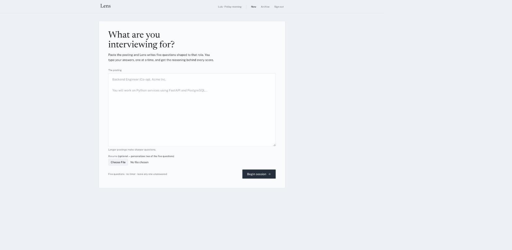
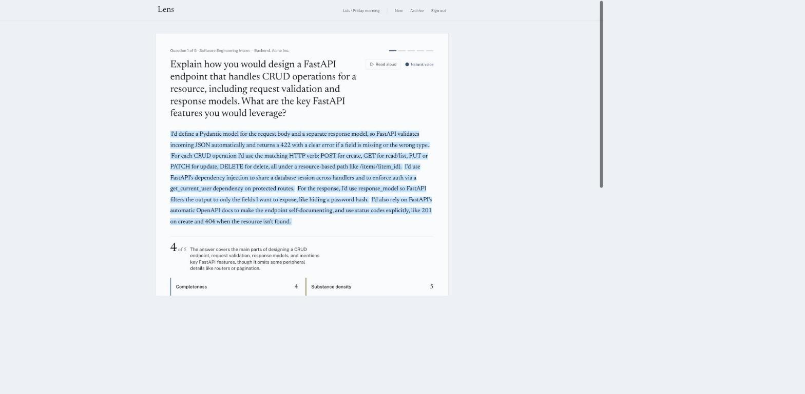
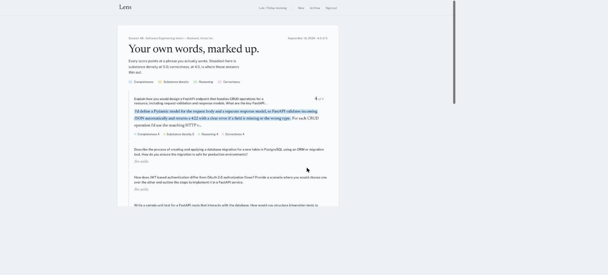
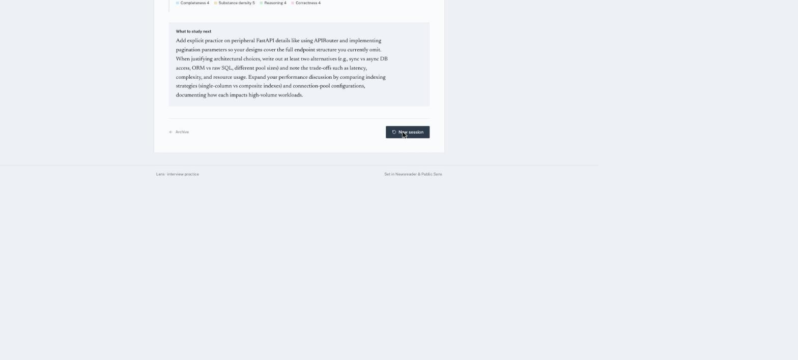
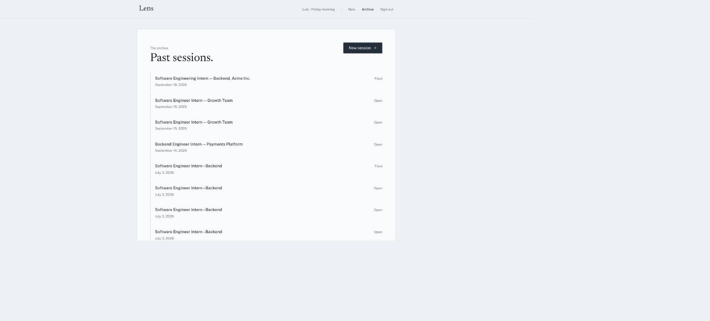
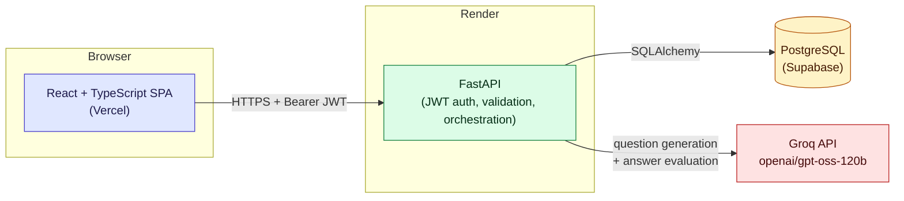
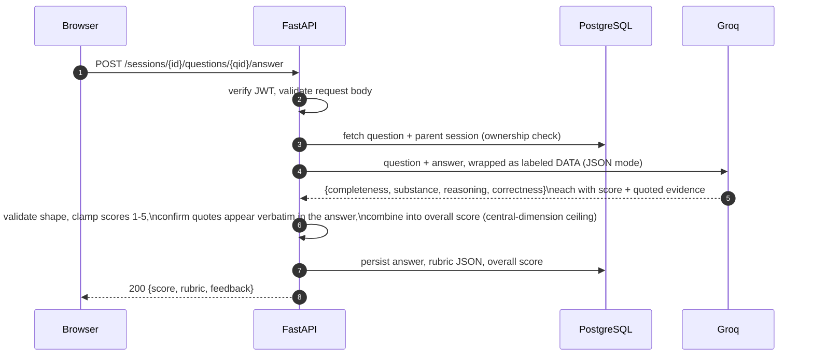
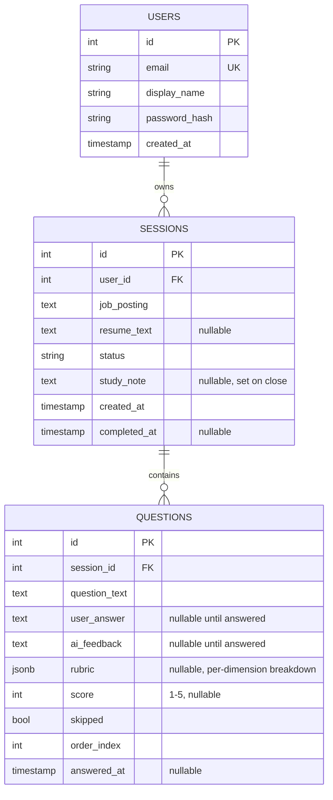

# Lens

**Paste a job posting. Get interview questions shaped to that role. Answer them. Get graded like a human would grade you — with the exact phrase you wrote next to every score.**

[](https://www.python.org/)
[](https://fastapi.tiangolo.com/)
[](https://react.dev/)
[](https://www.typescriptlang.org/)
[](https://www.postgresql.org/)
[](https://groq.com/)
[](LICENSE)

**Live demo:** **[lens-tau-nine.vercel.app](https://lens-tau-nine.vercel.app/)**
> The API runs on Render's free tier, which spins down when idle — the first request after a while can take 30–60s to wake up. Every request after that is instant.

---

## What it is

Lens is a web app for practicing technical interviews. Paste a real job posting, and it generates five interview questions shaped specifically to that role. Answer them one at a time — by typing or by voice — and each answer is scored across four dimensions (not just "good" or "bad") with the exact sentence that earned or cost you points highlighted inline. At the end of a session, Lens looks across your weakest-scoring dimensions and writes you a short, specific "what to study next."

Built for students and job seekers preparing for co-op and internship interviews who want feedback sharper than "looks good."

## Screenshots

| | |
|---|---|
|  **Paste the posting** — Lens turns it into five role-shaped questions. |  **Graded with evidence** — every score points at the exact phrase that earned it. |
|  **Session summary** — every answer, marked up, color-coded by dimension. |  **What to study next** — a targeted note built from your weakest dimensions. |
|  **Session history** — every past session, filed for later. | |

## Key features

- **Four-dimension rubric grading** — every answer is scored on *completeness*, *substance density*, *reasoning*, and *correctness* (1–5 each), not a single opaque number. Each dimension score is backed by a direct quote from the answer, validated server-side against the actual submitted text before it's ever shown.
- **Resume-blended questions** — optionally upload a resume (PDF/DOCX); three of the five questions come from the job posting, two are generated from your actual experience.
- **Prompt-injection–hardened LLM calls** — job postings, resumes, and answers are untrusted user input. They're never placed in the system prompt; they're wrapped, explicitly labeled as data, and isolated from instructions — backed by a dedicated test suite (`tests/test_llm_injection.py`).
- **"What to study next"** — at session close, Lens aggregates your lowest-scoring rubric dimensions across all answered questions into one short, actionable note.
- **Answer by voice** — speech-to-text for answering, plus optional "natural voice" text-to-speech for reading questions aloud (in-browser ONNX model, opt-in — see [Licensing](#licensing)).
- **Skip and resume** — leave any question unanswered and come back; nothing blocks progress through a session.
- **Session history** — every past session is saved and revisitable.

## Tech stack

| Layer | Technology | Why |
|---|---|---|
| Backend | FastAPI (Python 3.12) | Async, typed, self-documenting API |
| Database | PostgreSQL (Supabase) | Relational — sessions and questions are naturally normalized |
| ORM / migrations | SQLAlchemy 2.0 + Alembic | Versioned schema changes, no manual SQL against prod |
| Auth | JWT (PyJWT, HS256) + bcrypt | Stateless auth that scales horizontally; slow, salted password hashing |
| AI | Groq (`openai/gpt-oss-120b`) via the official `groq` SDK | Fast inference, generous free tier, OpenAI-compatible JSON mode |
| Frontend | React 19 + TypeScript + Vite | Type-safe UI, fast dev loop |
| Data fetching | TanStack Query | Cache-aware, resilient to the API's cold starts |
| Styling | Tailwind CSS 4 | Utility-first, no separate design system to maintain |
| Deployment | Render (API) + Vercel (frontend) + Supabase (Postgres) | Free tier across the whole stack |

## Architecture



The frontend never talks to Groq directly — every LLM call is proxied and validated by the backend, so the API key never reaches the browser and every response is checked against an expected shape before it's trusted or stored.

## How answer evaluation works

This is the core interaction in the app, and the one with the most engineering behind it:



If Groq returns something malformed, a quote that doesn't actually appear in the answer, or an out-of-range score, the backend rejects it rather than trusting it blindly — the rubric shown to the user is always grounded in something it independently verified.

## Data model



Notable decisions:
- A session's overall score is computed dynamically (`AVG` over its questions) rather than stored — it can never drift out of sync with the underlying answers.
- `skipped` is the source of truth for a skipped question, not the absence of an answer — a question can legitimately be unanswered without being skipped (session still in progress).
- Deletes cascade: removing a user removes their sessions, which removes their questions. No orphaned rows.

## API reference

All protected routes require `Authorization: Bearer <jwt>`.

| Method | Path | Auth | Description |
|---|---|:---:|---|
| POST | `/auth/register` | – | Create a new user |
| POST | `/auth/login` | – | Log in, receive a JWT |
| GET | `/auth/me` | ✅ | Current user info |
| POST | `/sessions` | ✅ | Create a session from a job posting |
| GET | `/sessions` | ✅ | List past sessions |
| GET | `/sessions/{id}` | ✅ | Session detail + all questions |
| POST | `/sessions/{id}/resume` | ✅ | Upload a resume (PDF/DOCX) to blend into question generation |
| POST | `/sessions/{id}/questions` | ✅ | Generate the five questions via Groq |
| POST | `/sessions/{id}/questions/{qid}/answer` | ✅ | Submit an answer, get scored |
| POST | `/sessions/{id}/questions/{qid}/skip` | ✅ | Skip a question |
| PATCH | `/sessions/{id}` | ✅ | Close the session (generates the study note) |

## Project structure

```
lens/
├── main.py                  # FastAPI app, CORS, exception handling
├── app/
│   ├── routers/              # auth.py, sessions.py — route handlers
│   ├── models.py              # SQLAlchemy models
│   ├── schemas.py             # Pydantic request/response schemas
│   ├── auth.py                 # JWT issuing/verification, password hashing
│   ├── database.py             # Engine/session setup
│   ├── llm.py                   # Groq integration: question generation, answer evaluation
│   ├── resume.py                # PDF/DOCX parsing, upload guards
│   └── study.py                  # "What to study next" aggregation
├── alembic/                  # Versioned DB migrations
├── tests/                     # pytest suite, incl. prompt-injection isolation tests
├── frontend/
│   └── src/
│       ├── pages/               # Home, Interview, Summary, History, Login
│       ├── components/          # Answer feedback, voice input, layout, UI primitives
│       ├── lib/                 # API client, auth context, rubric logic, TTS worker
│       └── hooks/
└── docs/screenshots/        # README images
```

## Getting started

### Prerequisites
- Python 3.12 (pinned via `.python-version`)
- Node 22 (pinned via `.nvmrc`)
- PostgreSQL (local or a Supabase project)

### Backend

```bash
git clone https://github.com/ltanafranca1004/lens.git
cd lens
python -m venv venv && source venv/bin/activate
pip install -r requirements.txt

cp .env.example .env
# fill in DATABASE_URL and JWT_SECRET at minimum — see Environment variables below

alembic upgrade head
uvicorn main:app --reload --port 8000
```

Leave `USE_MOCK_LLM=true` (the default) to run the whole app without a Groq API key — question generation and grading return deterministic mock responses instead of calling the real API.

### Frontend

```bash
cd frontend
npm install
npm run dev
```

The dev server proxies `/auth` and `/sessions` to `localhost:8000`, so no `VITE_API_URL` is needed locally.

## Environment variables

**Backend (`.env`, copy from `.env.example`):**

| Variable | Purpose |
|---|---|
| `DATABASE_URL` | Postgres connection string used by the app and Alembic |
| `JWT_SECRET` | Signing secret for auth tokens — generate with `openssl rand -hex 32` |
| `GROQ_API_KEY` | Groq API key, used only when `USE_MOCK_LLM=false` |
| `USE_MOCK_LLM` | `true` returns canned responses with no API calls; `false` calls Groq |
| `CORS_ORIGINS` | Comma-separated list of allowed browser origins |

**Frontend (`frontend/.env`, copy from `frontend/.env.example`):**

| Variable | Purpose |
|---|---|
| `VITE_API_URL` | API base URL in production; empty locally (uses the Vite proxy) |

## Testing

```bash
source venv/bin/activate
pytest tests/
```

Notable coverage: `tests/test_llm_injection.py` verifies that job postings, resumes, and answers can't manipulate the model into ignoring its scoring instructions; `tests/test_evaluate_answer.py` covers the rubric-combination and evidence-validation logic directly.

## Deployment

The app is deployed exactly as configured in this repo — `render.yaml` (API) and `frontend/vercel.json` (SPA). Render's build step runs `alembic upgrade head` before starting `uvicorn`, so a deploy always ships with an up-to-date schema. Supabase's session-mode connection pooler is used in production since Render's network is IPv4-only.

## Security notes

- Passwords are hashed with bcrypt; never stored or logged in plaintext.
- Auth is stateless JWT (HS256, 7-day expiry) — no server-side session store.
- All LLM prompts treat user-supplied content (job postings, resumes, answers) as **data, never instructions** — wrapped and explicitly labeled, kept out of the system prompt, and covered by a dedicated injection test suite.
- Resume uploads are capped (5 MB) and `.docx` files are checked against their internal zip central directory before parsing, to guard against zip-bomb-style decompression attacks.
- Every LLM response is shape-validated (score ranges, required fields, quotes actually present in the source text) before it's persisted or shown to a user.

## Scope

Lens is intentionally scoped to one loop: **paste a posting → generate questions → answer → get graded → review**. Sign-up/login, question generation, per-question grading with skip support, and session history are the full V1 feature set — deliberately, so the core loop stays sharp instead of half-covering more ground.

What's next: verifying answers against resume claims directly (the resume text is already captured per-session for this), and voice mode polish.

## Licensing

Lens's own code is [MIT-licensed](LICENSE). The optional "natural voice" text-to-speech feature pulls in one GPLv3 component (eSpeak NG, via `kokoro-js`) — see [`THIRD_PARTY_LICENSES.md`](THIRD_PARTY_LICENSES.md) for the full breakdown. The default voice engine (the browser's built-in `speechSynthesis`) carries no such obligations.

## Author

**Luis Tanafranca** — [github.com/ltanafranca1004](https://github.com/ltanafranca1004)

---

🤖 README generated with [Claude Code](https://claude.com/claude-code), from a live walkthrough of the running app.
